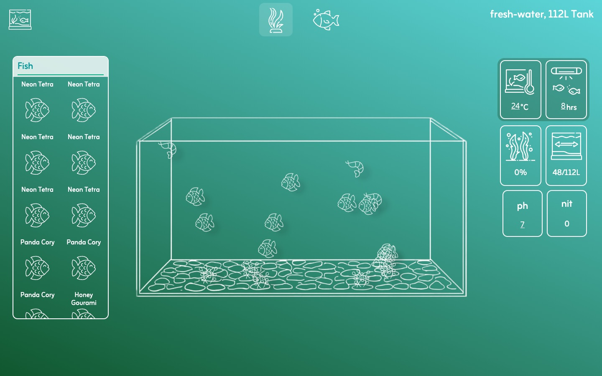
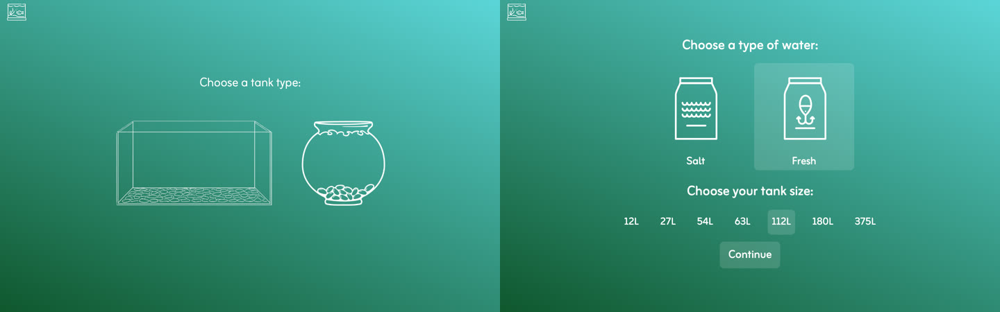
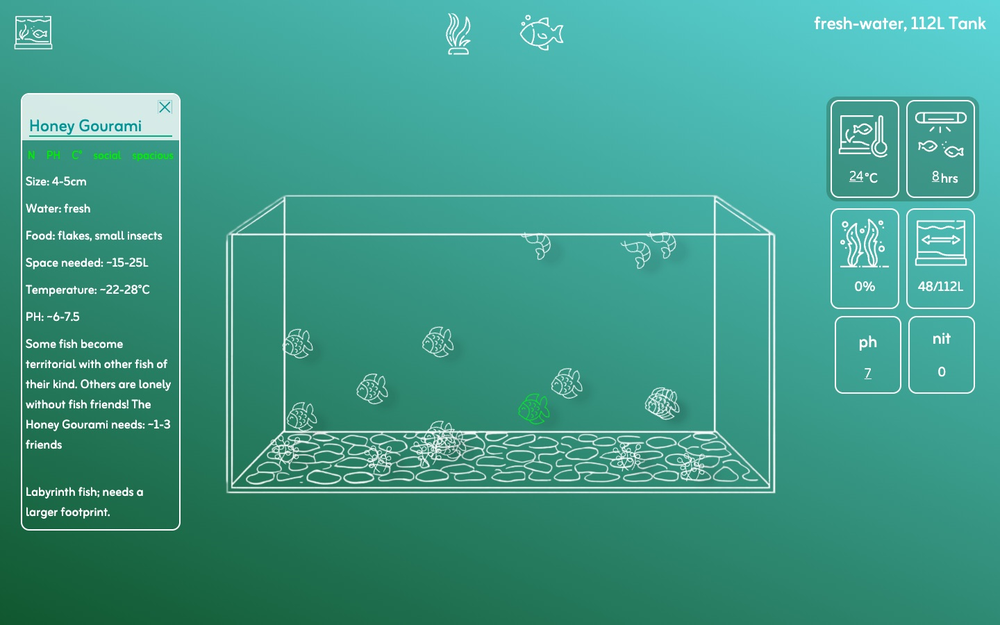
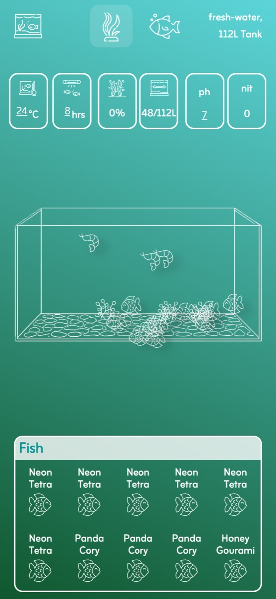

# What's in the Water

An aquarium planner. Pick a tank, stock it with fish, shrimp and plants, and see whether
everything in it can live together, before you buy anything.

**Live demo:** [whats-in-the-water.vercel.app](https://whats-in-the-water.vercel.app)



## How it works

1. Choose a tank shape, salt or fresh water, and a size from 12L to 375L
2. Add fish, shrimp and plants from the menus. They appear and swim around in the tank.
3. Adjust temperature, pH and light hours and watch how the tank reacts



## What the app calculates

Every species has its own data: size, space needed, temperature and pH range, group size,
waste produced and, for plants, light and nutrient needs. From that the app works out:

- **Crowding:** the minimum space of every animal added up against the tank size
- **Nitrate:** waste from the animals minus what the plants take up
- **Algae risk:** based on leftover nitrate, then scaled up or down by temperature and light
- **Per-species health:** whether temperature, pH, light, group size and space suit each
  species. Click any fish or plant to see its checks.





## Tech stack

- React 19 with Vite
- CSS Modules
- Inline SVG icons
- No backend: species data lives in `data/data.js`, and the calculations are plain functions
  in `utils/functions.js`

## What I learned

- Modelling real-world data. Each species is an object with ranges instead of single values,
  which made the health checks much simpler.
- Keeping logic out of components, so the calculations can be read and changed in one place
- Deriving values like nitrate and algae risk from state instead of storing them
- Positioning and animating elements inside two different tank shapes

## Running locally

```bash
npm install
npm run dev
```
